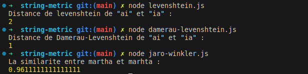

# string-metric
Algorithm for measuring the difference between two sequences

## Algorithm 
`Levenshtein distance` is a string metric for measuring the difference between two sequences. The Levenshtein distance between two words is the minimum number of single-character edits (insertions, deletions or substitutions) required to change one word into the other

`Damerau-Levenshtein` distance differs from the classical Levenshtein distance by including transpositions among its allowable operations

`Jaro-Winkler` measures the similarity between two strings.

## Demo

